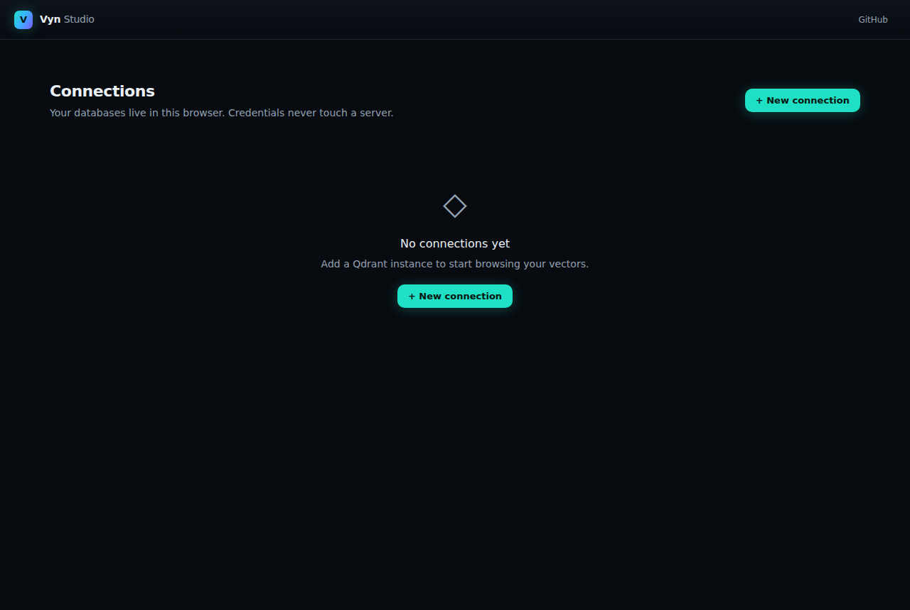
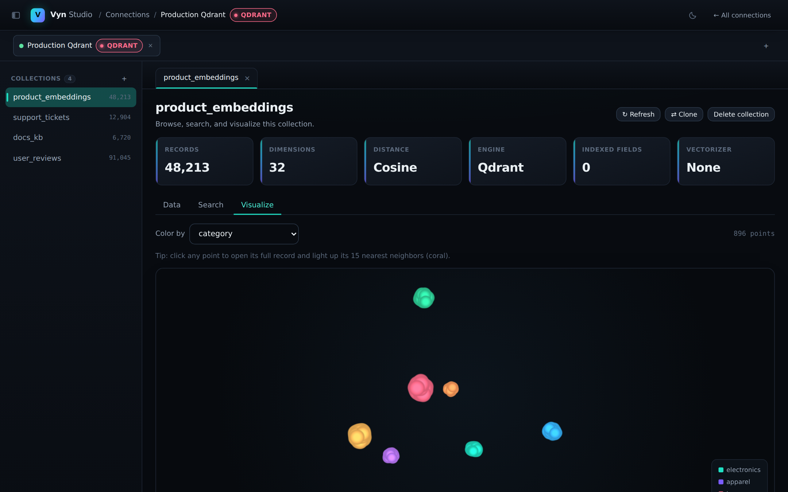

<div align="center">
  

  # Vyn Studio

  ### The universal studio for vector databases

  Connect, browse, search, and **visualize** any vector database — cloud or
  self-hosted — from one fast, modern UI. Think MongoDB Compass / Postman, but
  for vectors, with a 3D embedding explorer no other tool has.

  [](https://github.com/amulyakpadhan/vector-studio/actions/workflows/desktop.yml)
  [](packages/core/LICENSE)
  [](LICENSE)
  [](package.json)

  <br/>

  <a href="docs/assets/dashboard.png">
    
  </a>
</div>

<p align="center">
  <sub>
    <a href="#why">Why</a> ·
    <a href="#what-it-does">What it does</a> ·
    <a href="#supported-engines">Engines</a> ·
    <a href="#quickstart">Quickstart</a> ·
    <a href="#desktop-app">Desktop</a> ·
    <a href="#architecture">Architecture</a> ·
    <a href="#roadmap">Roadmap</a>
  </sub>
</p>

---

## Why

Every vector database ships its own console, and none of them talk to each
other. If you use Qdrant *and* Pinecone, you juggle two dashboards, two mental
models, and still can't actually *see* your embeddings. Vyn Studio is one
interface across all of them — and the first to render your live vectors as
an explorable 3D space.

The trust model is the important part: **your database credentials and data
never touch our servers.** All connectors run in your browser or the desktop
app; the only thing we'd ever host is an optional account for team features.
Same posture as Compass, TablePlus, and Postman.

## What it does

- **Connect any vector DB** — one connection manager for all engines,
  credentials stored locally, never uploaded.
- **Browse & edit** — paginated data grid, record inspector, create/delete
  collections, edit payloads, insert/delete records.
- **Search** — vector similarity search with a capability-aware UI that
  adapts to what each engine supports.
- **Visualize (the differentiator)** — sample a collection's stored vectors,
  project them to 3D with **UMAP**, and explore them as a glowing point
  cloud. Color by any metadata field. **Click any point to light up its
  nearest neighbors** — a live similarity query, visualized, with no
  embedding API required.
- **Resizable, collapsible workspace** — drag the collections rail to any
  width or tuck it away entirely (`Ctrl`/`⌘` `B`) to give the data grid and
  the 3D view the room they deserve.
- **Light & dark** — a system-matching theme by default, or pin it either way
  from the toggle in the topbar.
- **Local bridge** — a tiny optional proxy (`pnpm bridge`, run from this
  repo) that lets the browser reach self-hosted DBs on `localhost` and
  CORS-restricted clouds, without your data leaving your machine. Not yet
  published to npm, so it's run from a clone for now (see Quickstart below).

<div align="center">
  <br/>

  <a href="docs/assets/projection.png">
    
  </a>

  <sub><i>Live embeddings projected to 3D. Each point is a record; clusters are semantic neighborhoods.</i></sub>
</div>

## Supported engines

| Engine | Connect | Browse / CRUD | Vector search | Projection |
| --- | :---: | :---: | :---: | :---: |
| **Qdrant** | ✅ | ✅ | ✅ | ✅ |
| **Pinecone** | ✅ | ✅ | ✅ | ✅ |
| **Weaviate** | ✅ | ✅ | ✅ (+ keyword/hybrid) | ✅ |
| **Chroma** | ✅ | ✅ | ✅ | ✅ |
| **Milvus** | ✅ | ✅ | ✅ | ✅ |

Adding an engine means implementing one `VectorConnector` interface — the
entire UI and the visualization work against it for free.

## Quickstart

Requires Node 20+ and pnpm.

```bash
pnpm install
pnpm --filter @vyn/web dev         # open http://localhost:3000
```

Add a connection (a Qdrant URL, or a Pinecone API key), open it, and browse.
Hit the **Visualize** tab on any collection to project it.

**Self-hosted or Pinecone?** The browser can't reach `localhost` databases or
Pinecone's API directly (CORS), so run the bridge in a second terminal:

```bash
pnpm bridge        # requires Node 22.6+
```

The studio auto-detects it and offers to route the connection through it.
(The bridge isn't published to npm yet — for now it's run from a clone of
this repo, same as above. `npx @vyn/bridge` will work once it ships as a
standalone package.)

## Desktop app

The same studio, packaged as a native window with [Tauri](https://tauri.app) —
no browser tab, no bridge process to run separately, and self-hosted or
`localhost` databases just work. It's a thin native shell over the identical
web build, so every feature above ships there too.

```bash
pnpm --filter @vyn/desktop dev       # launch in dev mode
pnpm --filter @vyn/desktop build     # produce a native installer
```

## Architecture

A TypeScript monorepo. **No Python anywhere** — connectors and the
UMAP/Three.js projection all run client-side, which is what lets credentials
stay on your machine and made the desktop app a thin wrapper over the exact
same build.

```
apps/
  web/          Next.js studio (this is the app)
  desktop/      Tauri shell wrapping apps/web's static export
packages/
  core/         @vyn/core   — vector-DB connector layer (MIT; runs in the browser)
  viz/          @vyn/viz    — UMAP projection + Three.js point-cloud renderer
  bridge/       @vyn/bridge — localhost proxy for self-hosted / CORS-restricted DBs
```

See [`ARCHITECTURE.md`](ARCHITECTURE.md) for the full design, including the
account-server plans.

## Deployment

The studio is fully client-side and deploys as a static/SSR Next.js app on
Vercel's free tier — no server or database to provision. See
[`docs/DEPLOY.md`](docs/DEPLOY.md).

## Development

```bash
pnpm test          # all package test suites
pnpm typecheck     # strict TypeScript across the monorepo
pnpm build         # build everything
```

## Roadmap

- [x] Monorepo + connector layer (Qdrant, Pinecone)
- [x] Studio: connections, browse/CRUD, search
- [x] 3D embedding projection + click-to-query overlay
- [x] Local bridge for self-hosted / CORS
- [x] Landing page
- [x] Weaviate connector (REST + GraphQL search)
- [x] Chroma connector
- [x] Milvus connector
- [x] Desktop app (Tauri)
- [x] Light & dark theme
- [ ] Team features (shared connections, cross-DB migration)

## License

Open-core:

- **`packages/core`** is **MIT** — a universal vector-DB client you can use
  in any project.
- The **app and the rest of the packages** are **AGPL-3.0-only**.

Not affiliated with Qdrant, Pinecone, Weaviate, Milvus, or Chroma; all
trademarks belong to their owners.
